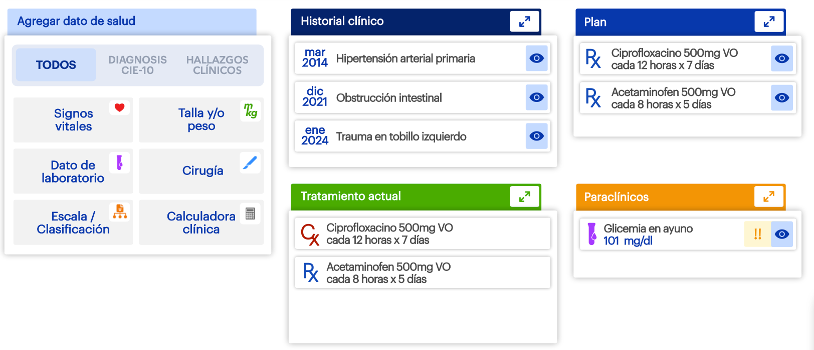

# Historia de Usuario: Visualización de Componentes de Resumen Clínico con Contenido Dinámico

**Como** un médico,
**Quiero** visualizar la información clave del paciente organizada en componentes (widgets) que cargan datos dinámicamente y ofrecen opciones de filtrado,
**Para** poder evaluar rápidamente el historial, el plan de tratamiento y los datos relevantes, y así tomar decisiones clínicas más eficientes y seguras.

---

## 📸 Demo Visual

---

### Criterios de Aceptación (AC)

1.  **AC1: Despliegue General de Widgets**
    *   **Dado** que ingreso al perfil de un paciente,
    *   **Cuando** la pantalla principal carga,
    *   **Entonces** debo ver cinco componentes (widgets) principales: "Agregar dato de salud", "Historial clínico", "Tratamiento actual", "Plan" y "Paraclínicos".

2.  **AC2: Estructura de Pestañas en "Agregar dato de salud"**
    *   **Dado** que el widget "Agregar dato de salud" está visible,
    *   **Cuando** observo su parte superior,
    *   **Entonces** debe mostrar una barra de navegación con tres pestañas (tabs): "TODOS", "DIAGNÓSTICO CIE-10" y "HALLAZGOS CLÍNICOS".

3.  **AC3: Comportamiento de la Pestaña "TODOS"**
    *   **Dado** que el widget "Agregar dato de salud" se carga,
    *   **Cuando** la vista inicial se muestra,
    *   **Entonces** la pestaña "TODOS" debe estar seleccionada por defecto, mostrando todos los botones de acción ("Signos vitales", "Dato de laboratorio", etc.).

4.  **AC4: Comportamiento de las Pestañas de Filtro**
    *   **Dado** que estoy en el widget "Agregar dato de salud",
    *   **Cuando** hago clic en la pestaña "DIAGNÓSTICO CIE-10" o "HALLAZGOS CLÍNICOS",
    *   **Entonces** el contenido debajo de las pestañas debe actualizarse para mostrar una vista o un texto correspondiente a la pestaña seleccionada.

5.  **AC5: Estructura Común de Widgets de Datos**
    *   **Dado** que los widgets "Historial clínico", "Tratamiento actual", "Plan" y "Paraclínicos" están visibles,
    *   **Cuando** los observo,
    *   **Entonces** cada uno debe tener una cabecera con un color distintivo, su título y un ícono para expandir.

6.  **AC6: Formato de Ítem en "Historial clínico"**
    *   **Dado** que el widget "Historial clínico" muestra al menos un elemento,
    *   **Cuando** veo una entrada,
    *   **Entonces** debe mostrar la fecha, la descripción del hallazgo y un ícono de visualización (ojo).

7.  **AC7: Formato de Ítem en "Tratamiento actual" y "Plan"**
    *   **Dado** que el widget "Tratamiento actual" o "Plan" muestra al menos un elemento,
    *   **Cuando** veo una entrada,
    *   **Entonces** debe mostrar el ícono `Rx`, el nombre del medicamento, dosis y posología.

8.  **AC8: Formato de Ítem en "Paraclínicos"**
    *   **Dado** que el widget "Paraclínicos" muestra al menos un elemento,
    *   **Cuando** veo una entrada,
    *   **Entonces** debe mostrar un ícono de laboratorio, el nombre del examen, el resultado, y opcionalmente un ícono de alerta (!!) y un ícono de visualización (ojo).

9.  **AC9: Renderizado de Contenido Dinámico**
    *   **Dado** que se proporciona una lista de datos (ej. un array) para "Historial clínico", "Tratamiento actual", "Plan" o "Paraclínicos",
    *   **Cuando** el widget correspondiente se renderiza,
    *   **Entonces** debe ser capaz de iterar sobre esa lista y mostrar una entrada visual por cada ítem en los datos.
    *   **Y** si la lista de datos está vacía, el widget debe mostrar un estado vacío (ej. "No hay datos para mostrar").

---

### Definition of Ready (DoR) - Definición de Preparado
*(Criterios que deben cumplirse ANTES de que el equipo de desarrollo comience a trabajar en esta historia).*

*   **Aprobación:** La historia de usuario y sus ACs han sido aprobados por el Product Owner.
*   **Diseño UI/UX:** El diseño final de los widgets, incluyendo el comportamiento de las pestañas, está disponible.
*   **APIs / Contratos de Datos:** Los endpoints de la API que devuelven las listas de datos para los widgets dinámicos están definidos, documentados y disponibles.
*   **Activos Gráficos (Assets):** Todos los íconos necesarios están disponibles en el formato requerido (SVG, PNG, etc.).
*   **Sin Dependencias:** No existen dependencias técnicas o funcionales bloqueantes de otras historias.

---

### Definition of Done (DoD) - Definición de Terminado
*(Criterios que deben cumplirse para considerar que la historia de usuario está COMPLETA).*

*   **Código Implementado:** El código para los cinco widgets, incluyendo la lógica de pestañas y el renderizado dinámico, está completo y sigue los estándares del proyecto.
*   **AC Cumplidos:** Todos los Criterios de Aceptación han sido probados y verificados.
*   **Pruebas Específicas:**
    *   Se ha probado que los widgets de datos renderizan correctamente 0, 1 y múltiples ítems.
    *   Se ha probado que la navegación por pestañas en "Agregar dato de salud" funciona como se espera.
*   **Fidelidad al Diseño:** La interfaz implementada es fiel al diseño proporcionado.
*   **Pruebas Unitarias/Integración:** Se han escrito pruebas que cubren la lógica de renderizado de listas y el cambio de estado de las pestañas.
*   **Revisión de Código (Code Review):** El código ha sido revisado y aprobado por otro miembro del equipo.
*   **Fusionado (Merged):** El código ha sido integrado exitosamente en la rama principal de desarrollo.
*   **Sin Regresiones:** La implementación no ha introducido errores en funcionalidades existentes.
